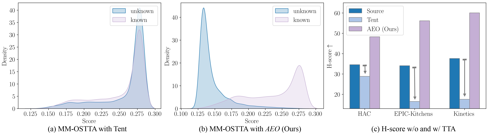

<div align="center">

<h1>Towards Robust Multimodal Open-set Test-time Adaptation via Adaptive Entropy-aware Optimization</h1>

<div>
    <a href='https://sites.google.com/view/dong-hao/' target='_blank'>Hao Dong</a><sup>1</sup>&emsp;
    <a href='https://chatzi.ibk.ethz.ch/about-us/people/prof-dr-eleni-chatzi.html' target='_blank'>Eleni Chatzi</a><sup>1</sup>&emsp;
    <a href='https://people.epfl.ch/olga.fink?lang=en' target='_blank'>Olga Fink</a><sup>2</sup>
</div>
<div>
    <sup>1</sup>ETH Zurich, <sup>2</sup>EPFL
</div>


<div>
    <h4 align="center">
        • <a href="https://arxiv.org/abs/2501.13924" target='_blank'>ICLR 2025</a> •
    </h4>
</div>


<div style="text-align:center">

</div>

---

</div>


Figure 1: (a) Tent minimizes the entropy of all samples, making it difficult to separate the prediction score distributions of known and unknown samples. (b) Our AEO amplifies entropy differences between known and unknown samples through adaptive optimization. (c) As a result, Tent negatively impacts MM-OSTTA performance while AEO significantly improves unknown class detection.

## Environment
The code was tested using `Python 3.10.13`, `torch 2.3.1+cu121` and `NVIDIA GeForce RTX 3090`, more dependencies are in `requirement.txt`.

Environments:
```
mmcv-full 1.2.7
mmaction2 0.13.0
```
## Prepare Dataset

### Download EPIC-Kitchens Dataset
```
bash utils/download_epic_script.sh  
```
Download Audio files [EPIC-KITCHENS-audio.zip](https://huggingface.co/datasets/hdong51/Human-Animal-Cartoon/blob/main/EPIC-KITCHENS-audio.zip).

Unzip all files and the directory structure should be modified to match:
<details>
<summary>Click for details...</summary>

```
├── rgb
|   ├── test
|   |   ├── D1
|   |   |   ├── P08_09.wav
|   |   |   ├── P08_09
|   |   |   |     ├── frame_0000000000.jpg
|   |   |   |     ├── ...
|   |   |   ├── P08_10.wav
|   |   |   ├── P08_10
|   |   |   ├── ...
|   |   ├── D2
|   |   ├── D3

├── flow
|   ├── test
|   |   ├── D1
|   |   ├── D2
|   |   ├── D3
```

</details>

### Download HAC Dataset
This dataset can be downloaded at [link](https://huggingface.co/datasets/hdong51/Human-Animal-Cartoon/tree/main).

Unzip all files and the directory structure should be modified to match:
<details>
<summary>Click for details...</summary>

```
HAC
├── human
|   ├── videos
|   |   ├── ...
|   ├── flow
|   |   ├── ...
|   ├── audio
|   |   ├── ...

├── animal
|   ├── videos
|   |   ├── ...
|   ├── flow
|   |   ├── ...
|   ├── audio
|   |   ├── ...

├── cartoon
|   ├── videos
|   |   ├── ...
|   ├── flow
|   |   ├── ...
|   ├── audio
|   |   ├── ...
```

</details>

### Download Kinetics-600 Dataset
Download Kinetics-600 video data by 
```
wget -i utils/filtered_k600_train_path.txt
```
Extract all files and get audio data from video data by
```
python utils/generate_audio_files.py
```

Unzip all files and the directory structure should be modified to match:
<details>
<summary>Click for details...</summary>


```
Kinetics-600
├── video
|   ├── building sandcastle
|   |   ├── *.mp4
|   |   ├── *.wav
|   |── ...
```

</details>

Create audio corruptions (change 'traffic' to 'crowd', 'rain', 'thunder', 'wind' to create different corruptions):
```
python utils/make_c_audio_hac.py --corruption 'traffic' --severity 5 --data_path '/path/to/HAC/audio' --save_path '/path/to/HAC/audio-C' --weather_path 'utils/weather_audios/'
```
```
python utils/make_c_audio_kinetics.py --corruption 'traffic' --severity 5 --data_path '/path/to/Kinetics/audio' --save_path '/path/to/Kinetics/audio-C' --weather_path 'utils/weather_audios/'
```

Create video corruptions (change 'jpeg_compression' to 'gaussian_noise', 'defocus_blur', 'frost', 'brightness', 'pixelate' to create different corruptions):
```
python utils/make_c_video_hac.py --corruption 'jpeg_compression' --severity 5 --data_path /path/to/HAC/videos --save_path /path/to/HAC/video-C
```
```
python utils/make_c_video_kinetics.py --corruption 'jpeg_compression' --severity 5 --data_path '/path/to/Kinetics/videos' --save_path '/path/to/Kinetics/video-C' 
```

## Run the code
### EPIC-Kitchens Dataset

### Video and Audio
<details>
<summary>Click for details...</summary>

```
cd EPIC-rgb-flow-audio
```
Download pretrained [model1](https://huggingface.co/hdong51/AEO/blob/main/EPIC_D1_TTA_video_audio_single_pred.pt), [model2](https://huggingface.co/hdong51/AEO/blob/main/EPIC_D2_TTA_video_audio_single_pred.pt), and [model3](https://huggingface.co/hdong51/AEO/blob/main/EPIC_D3_TTA_video_audio_single_pred.pt), and put under `models/` folder

D1 → D2

```
python test_video_audio_EPIC_OSTTA_hac.py -s D1 -t D2 --num_workers 4 --lr 2e-5 --tanh_alpha 0.8 --online_adapt --a2d_ratio 0.1 --marginal_ent_wei 0.1 --bsz 32 --use_video --use_audio --use_single_pred --datapath /path/to/EPIC-KITCHENS/ --datapath_open '/path/to/HAC/' --resume_file 'models/EPIC_D1_TTA_video_audio_single_pred.pt' 
```

D1 → D3
```
python test_video_audio_EPIC_OSTTA_hac.py -s D1 -t D3 --num_workers 4 --lr 2e-5 --tanh_alpha 0.8 --online_adapt --a2d_ratio 0.1 --marginal_ent_wei 0.1 --bsz 32 --use_video --use_audio --use_single_pred --datapath /path/to/EPIC-KITCHENS/ --datapath_open '/path/to/HAC/' --resume_file 'models/EPIC_D1_TTA_video_audio_single_pred.pt'
```
D2 → D1
```
python test_video_audio_EPIC_OSTTA_hac.py -s D2 -t D1 --num_workers 4 --lr 2e-5 --tanh_alpha 0.8 --online_adapt --a2d_ratio 0.1 --marginal_ent_wei 0.1 --bsz 32 --use_video --use_audio --use_single_pred --datapath /path/to/EPIC-KITCHENS/ --datapath_open '/path/to/HAC/' --resume_file 'models/EPIC_D2_TTA_video_audio_single_pred.pt'
```
D2 → D3
```
python test_video_audio_EPIC_OSTTA_hac.py -s D2 -t D3 --num_workers 4 --lr 2e-5 --tanh_alpha 0.8 --online_adapt --a2d_ratio 0.1 --marginal_ent_wei 0.1 --bsz 32 --use_video --use_audio --use_single_pred --datapath /path/to/EPIC-KITCHENS/ --datapath_open '/path/to/HAC/' --resume_file 'models/EPIC_D2_TTA_video_audio_single_pred.pt'
```
D3 → D1
```
python test_video_audio_EPIC_OSTTA_hac.py -s D3 -t D1 --num_workers 4 --lr 2e-5 --tanh_alpha 0.8 --online_adapt --a2d_ratio 0.1 --marginal_ent_wei 0.1 --bsz 32 --use_video --use_audio --use_single_pred --datapath /path/to/EPIC-KITCHENS/ --datapath_open '/path/to/HAC/' --resume_file 'models/EPIC_D3_TTA_video_audio_single_pred.pt'
```
D3 → D2
```
python test_video_audio_EPIC_OSTTA_hac.py -s D3 -t D2 --num_workers 4 --lr 2e-5 --tanh_alpha 0.8 --online_adapt --a2d_ratio 0.1 --marginal_ent_wei 0.1 --bsz 32 --use_video --use_audio --use_single_pred --datapath /path/to/EPIC-KITCHENS/ --datapath_open '/path/to/HAC/' --resume_file 'models/EPIC_D3_TTA_video_audio_single_pred.pt'
```

</details>


### HAC Dataset

### Video and Audio
<details>
<summary>Click for details...</summary>


```
cd HAC-rgb-flow-audio
```
Download pretrained [model1](https://huggingface.co/hdong51/AEO/blob/main/HAC_animal_TTA_video_audio_single_pred.pt), [model2](https://huggingface.co/hdong51/AEO/blob/main/HAC_cartoon_TTA_video_audio_single_pred.pt), and [model3](https://huggingface.co/hdong51/AEO/blob/main/HAC_human_TTA_video_audio_single_pred.pt), and put under `models/` folder

H → A
```
python test_video_audio_HAC_OSTTA_epic.py -s 'human' -t 'animal' --num_workers 10  --online_adapt --a2d_ratio 0.1 --tanh_alpha 0.8 --lr 2e-5 --marginal_ent_wei 0.1 --bsz 32 --use_video --use_audio --use_single_pred --datapath /path/to/HAC/ --datapath_open '/path/to/EPIC-KITCHENS/' --resume_file 'models/HAC_human_TTA_video_audio_single_pred.pt' 
```
H → C
```
python test_video_audio_HAC_OSTTA_epic.py -s 'human' -t 'cartoon' --num_workers 10  --online_adapt --a2d_ratio 0.1 --tanh_alpha 0.9 --lr 2e-5 --marginal_ent_wei 0.1 --bsz 32 --use_video --use_audio --use_single_pred --datapath /path/to/HAC/ --datapath_open '/path/to/EPIC-KITCHENS/' --resume_file 'models/HAC_human_TTA_video_audio_single_pred.pt'  
```
A → H
```
python test_video_audio_HAC_OSTTA_epic.py -s 'animal' -t 'human' --num_workers 10  --online_adapt --a2d_ratio 0.1 --tanh_alpha 0.9 --lr 2e-5 --marginal_ent_wei 0.1 --bsz 32 --use_video --use_audio --use_single_pred --datapath /path/to/HAC/ --datapath_open '/path/to/EPIC-KITCHENS/' --resume_file 'models/HAC_animal_TTA_video_audio_single_pred.pt'  
```
A → C
```
python test_video_audio_HAC_OSTTA_epic.py -s 'animal' -t 'cartoon' --num_workers 10  --online_adapt --a2d_ratio 0.1 --tanh_alpha 0.9 --lr 2e-5 --marginal_ent_wei 0.1 --bsz 32 --use_video --use_audio --use_single_pred --datapath /path/to/HAC/ --datapath_open '/path/to/EPIC-KITCHENS/' --resume_file 'models/HAC_animal_TTA_video_audio_single_pred.pt'  
```
C → A
```
python test_video_audio_HAC_OSTTA_epic.py -s 'cartoon' -t 'animal' --num_workers 10  --online_adapt --a2d_ratio 0.1 --tanh_alpha 0.8 --lr 2e-5 --marginal_ent_wei 0.1 --bsz 32 --use_video --use_audio --use_single_pred --datapath /path/to/HAC/ --datapath_open '/path/to/EPIC-KITCHENS/' --resume_file 'models/HAC_cartoon_TTA_video_audio_single_pred.pt' 
```
C → H
```
python test_video_audio_HAC_OSTTA_epic.py -s 'cartoon' -t 'human' --num_workers 10  --online_adapt --a2d_ratio 0.1 --tanh_alpha 0.8 --lr 2e-5 --marginal_ent_wei 0.1 --bsz 32 --use_video --use_audio --use_single_pred --datapath /path/to/HAC/ --datapath_open '/path/to/EPIC-KITCHENS/' --resume_file 'models/HAC_cartoon_TTA_video_audio_single_pred.pt'   
```


</details>

### Video and Flow
<details>
<summary>Click for details...</summary>


```
cd HAC-rgb-flow-audio
```
Download pretrained [model1](https://huggingface.co/hdong51/AEO/blob/main/HAC_animal_TTA_video_flow_single_pred.pt), [model2](https://huggingface.co/hdong51/AEO/blob/main/HAC_cartoon_TTA_video_flow_single_pred.pt), and [model3](https://huggingface.co/hdong51/AEO/blob/main/HAC_human_TTA_video_flow_single_pred.pt), and put under `models/` folder

H → A
```
python test_video_flow_HAC_OSTTA_epic.py -s 'human' -t 'animal' --num_workers 10 --nepochs 1 --online_adapt --a2d_ratio 1.0 --tanh_alpha 0.5 --lr 2e-5 --marginal_ent_wei 0.1 --bsz 32 --steps 1 --use_video --use_flow --use_single_pred --datapath /path/to/HAC/ --datapath_open '/path/to/EPIC-KITCHENS/' --resume_file 'models/HAC_human_TTA_video_flow_single_pred.pt'
```
H → C
```
python test_video_flow_HAC_OSTTA_epic.py -s 'human' -t 'cartoon' --num_workers 10 --nepochs 1 --online_adapt --a2d_ratio 1.0 --tanh_alpha 0.5 --lr 2e-5 --marginal_ent_wei 0.1 --bsz 32 --steps 1 --use_video --use_flow --use_single_pred --datapath /path/to/HAC/ --datapath_open '/path/to/EPIC-KITCHENS/' --resume_file 'models/HAC_human_TTA_video_flow_single_pred.pt'
```
A → H
```
python test_video_flow_HAC_OSTTA_epic.py -s 'animal' -t 'human' --num_workers 10 --nepochs 1 --online_adapt --a2d_ratio 1.0 --tanh_alpha 0.5 --lr 2e-5 --marginal_ent_wei 0.1 --bsz 32 --steps 1 --use_video --use_flow --use_single_pred --datapath /path/to/HAC/ --datapath_open '/path/to/EPIC-KITCHENS/' --resume_file 'models/HAC_animal_TTA_video_flow_single_pred.pt' 
```
A → C
```
python test_video_flow_HAC_OSTTA_epic.py -s 'animal' -t 'cartoon' --num_workers 10 --nepochs 1 --online_adapt --a2d_ratio 1.0 --tanh_alpha 0.5 --lr 2e-5 --marginal_ent_wei 0.1 --bsz 32 --steps 1 --use_video --use_flow --use_single_pred --datapath /path/to/HAC/ --datapath_open '/path/to/EPIC-KITCHENS/' --resume_file 'models/HAC_animal_TTA_video_flow_single_pred.pt' 
```
C → A
```
python test_video_flow_HAC_OSTTA_epic.py -s 'cartoon' -t 'animal' --num_workers 10 --nepochs 1 --online_adapt --a2d_ratio 1.0 --tanh_alpha 0.5 --lr 2e-5 --marginal_ent_wei 0.1 --bsz 32 --steps 1 --use_video --use_flow --use_single_pred --datapath /path/to/HAC/ --datapath_open '/path/to/EPIC-KITCHENS/' --resume_file 'models/HAC_cartoon_TTA_video_flow_single_pred.pt' 
```
C → H
```
python test_video_flow_HAC_OSTTA_epic.py -s 'cartoon' -t 'human' --num_workers 10 --nepochs 1 --online_adapt --a2d_ratio 1.0 --tanh_alpha 0.5 --lr 2e-5 --marginal_ent_wei 0.1 --bsz 32 --steps 1 --use_video --use_flow --use_single_pred --datapath /path/to/HAC/ --datapath_open '/path/to/EPIC-KITCHENS/' --resume_file 'models/HAC_cartoon_TTA_video_flow_single_pred.pt' 
```

</details>

### Flow and Audio
<details>
<summary>Click for details...</summary>


```
cd HAC-rgb-flow-audio
```
Download pretrained [model1](https://huggingface.co/hdong51/AEO/blob/main/HAC_animal_TTA_flow_audio_single_pred.pt), [model2](https://huggingface.co/hdong51/AEO/blob/main/HAC_cartoon_TTA_flow_audio_single_pred.pt), and [model3](https://huggingface.co/hdong51/AEO/blob/main/HAC_human_TTA_flow_audio_single_pred.pt), and put under `models/` folder

H → A
```
python test_flow_audio_HAC_OSTTA_epic.py -s 'human' -t 'animal' --num_workers 10 --nepochs 1 --online_adapt --a2d_ratio 0.1 --tanh_alpha 0.8 --lr 2e-5 --marginal_ent_wei 0.1 --bsz 32 --steps 1 --use_flow --use_audio --use_single_pred --datapath /path/to/HAC/ --datapath_open '/path/to/EPIC-KITCHENS/' --resume_file 'models/HAC_human_TTA_flow_audio_single_pred.pt'  
```
H → C
```
python test_flow_audio_HAC_OSTTA_epic.py -s 'human' -t 'cartoon' --num_workers 10 --nepochs 1 --online_adapt --a2d_ratio 0.1 --tanh_alpha 0.8 --lr 2e-5 --marginal_ent_wei 0.1 --bsz 32 --steps 1 --use_flow --use_audio --use_single_pred --datapath /path/to/HAC/ --datapath_open '/path/to/EPIC-KITCHENS/' --resume_file 'models/HAC_human_TTA_flow_audio_single_pred.pt'    
```
A → H
```
python test_flow_audio_HAC_OSTTA_epic.py -s 'animal' -t 'human' --num_workers 10 --nepochs 1 --online_adapt --a2d_ratio 0.1 --tanh_alpha 0.8 --lr 2e-5 --marginal_ent_wei 0.1 --bsz 32 --steps 1 --use_flow --use_audio --use_single_pred --datapath /path/to/HAC/ --datapath_open '/path/to/EPIC-KITCHENS/' --resume_file 'models/HAC_animal_TTA_flow_audio_single_pred.pt'    
```
A → C
```
python test_flow_audio_HAC_OSTTA_epic.py -s 'animal' -t 'cartoon' --num_workers 10 --nepochs 1 --online_adapt --a2d_ratio 0.1 --tanh_alpha 0.8 --lr 2e-5 --marginal_ent_wei 0.1 --bsz 32 --steps 1 --use_flow --use_audio --use_single_pred --datapath /path/to/HAC/ --datapath_open '/path/to/EPIC-KITCHENS/' --resume_file 'models/HAC_animal_TTA_flow_audio_single_pred.pt'    
```
C → A
```
python test_flow_audio_HAC_OSTTA_epic.py -s 'cartoon' -t 'animal' --num_workers 10 --nepochs 1 --online_adapt --a2d_ratio 0.1 --tanh_alpha 0.8 --lr 2e-5 --marginal_ent_wei 0.1 --bsz 32 --steps 1 --use_flow --use_audio --use_single_pred --datapath /path/to/HAC/ --datapath_open '/path/to/EPIC-KITCHENS/' --resume_file 'models/HAC_cartoon_TTA_flow_audio_single_pred.pt'    
```
C → H
```
python test_flow_audio_HAC_OSTTA_epic.py -s 'cartoon' -t 'human' --num_workers 10 --nepochs 1 --online_adapt --a2d_ratio 0.1 --tanh_alpha 0.8 --lr 2e-5 --marginal_ent_wei 0.1 --bsz 32 --steps 1 --use_flow --use_audio --use_single_pred --datapath /path/to/HAC/ --datapath_open '/path/to/EPIC-KITCHENS/' --resume_file 'models/HAC_cartoon_TTA_flow_audio_single_pred.pt'    
```

</details>

### Video and Flow and Audio
<details>
<summary>Click for details...</summary>


```
cd HAC-rgb-flow-audio
```
Download pretrained [model1](https://huggingface.co/hdong51/AEO/blob/main/HAC_animal_TTA_video_flow_audio_single_pred.pt), [model2](https://huggingface.co/hdong51/AEO/blob/main/HAC_cartoon_TTA_video_flow_audio_single_pred.pt), and [model3](https://huggingface.co/hdong51/AEO/blob/main/HAC_human_TTA_video_flow_audio_single_pred.pt), and put under `models/` folder

H → A
```
python test_video_flow_audio_HAC_OSTTA_epic.py -s 'human' -t 'animal' --num_workers 10 --nepochs 1 --online_adapt --a2d_ratio 0.1 --tanh_k 4.0 --tanh_alpha 0.7 --lr 2e-5 --marginal_ent_wei 0.1 --bsz 32 --steps 1 --use_video --use_flow --use_audio --use_single_pred --datapath /path/to/HAC/ --datapath_open '/path/to/EPIC-KITCHENS/' --resume_file 'models/HAC_human_TTA_video_flow_audio_single_pred.pt' 
```
H → C
```
python test_video_flow_audio_HAC_OSTTA_epic.py -s 'human' -t 'cartoon' --num_workers 10 --nepochs 1 --online_adapt --a2d_ratio 0.1 --tanh_k 4.0 --tanh_alpha 0.7 --lr 2e-5 --marginal_ent_wei 0.1 --bsz 32 --steps 1 --use_video --use_flow --use_audio --use_single_pred --datapath /path/to/HAC/ --datapath_open '/path/to/EPIC-KITCHENS/' --resume_file 'models/HAC_human_TTA_video_flow_audio_single_pred.pt'   
```
A → H
```
python test_video_flow_audio_HAC_OSTTA_epic.py -s 'animal' -t 'human' --num_workers 10 --nepochs 1 --online_adapt --a2d_ratio 0.1 --tanh_k 4.0 --tanh_alpha 0.7 --lr 2e-5 --marginal_ent_wei 0.1 --bsz 32 --steps 1 --use_video --use_flow --use_audio --use_single_pred --datapath /path/to/HAC/ --datapath_open '/path/to/EPIC-KITCHENS/' --resume_file 'models/HAC_animal_TTA_video_flow_audio_single_pred.pt'   
```
A → C
```
python test_video_flow_audio_HAC_OSTTA_epic.py -s 'animal' -t 'cartoon' --num_workers 10 --nepochs 1 --online_adapt --a2d_ratio 0.1 --tanh_k 4.0 --tanh_alpha 0.7 --lr 2e-5 --marginal_ent_wei 0.1 --bsz 32 --steps 1 --use_video --use_flow --use_audio --use_single_pred --datapath /path/to/HAC/ --datapath_open '/path/to/EPIC-KITCHENS/' --resume_file 'models/HAC_animal_TTA_video_flow_audio_single_pred.pt'   
```
C → A
```
python test_video_flow_audio_HAC_OSTTA_epic.py -s 'cartoon' -t 'animal' --num_workers 10 --nepochs 1 --online_adapt --a2d_ratio 0.1 --tanh_k 4.0 --tanh_alpha 0.7 --lr 2e-5 --marginal_ent_wei 0.1 --bsz 32 --steps 1 --use_video --use_flow --use_audio --use_single_pred --datapath /path/to/HAC/ --datapath_open '/path/to/EPIC-KITCHENS/' --resume_file 'models/HAC_cartoon_TTA_video_flow_audio_single_pred.pt'   
```
C → H
```
python test_video_flow_audio_HAC_OSTTA_epic.py -s 'cartoon' -t 'human' --num_workers 10 --nepochs 1 --online_adapt --a2d_ratio 0.1 --tanh_k 4.0 --tanh_alpha 0.7 --lr 2e-5 --marginal_ent_wei 0.1 --bsz 32 --steps 1 --use_video --use_flow --use_audio --use_single_pred --datapath /path/to/HAC/ --datapath_open '/path/to/EPIC-KITCHENS/' --resume_file 'models/HAC_cartoon_TTA_video_flow_audio_single_pred.pt'   
```


</details>

### Kinetics Dataset
### Video and Audio
<details>
<summary>Click for details...</summary>


```
cd HAC-rgb-flow-audio
```
Download pretrained [model1](https://huggingface.co/hdong51/AEO/blob/main/Kinetics_100_video_audio_single_pred_3090.pt), and put under `models/` folder

defocus_blur + wind
```
python test_video_audio_kinetics_OSTTA_hac.py --num_workers 10 --nepochs 1 --use_kinetics_100 --online_adapt --a2d_ratio 0.1 --tanh_k 4.0 --tanh_alpha 0.8 --lr 2e-5 --audio_noise_type 'wind' --video_noise_type 'defocus_blur' --marginal_ent_wei 1.0 --bsz 32 --steps 1 --use_video --use_audio --use_single_pred --datapath /path/to/Kinetics/ --datapath_open '/path/to/HAC/' --resume_file 'models/Kinetics_100_video_audio_single_pred_3090.pt'    
```
frost + traffic
```
python test_video_audio_kinetics_OSTTA_hac.py --num_workers 10 --nepochs 1 --use_kinetics_100 --online_adapt --a2d_ratio 0.1 --tanh_k 4.0 --tanh_alpha 0.8 --lr 2e-5 --audio_noise_type 'traffic' --video_noise_type 'frost' --marginal_ent_wei 1.0 --bsz 32 --steps 1 --use_video --use_audio --use_single_pred --datapath /path/to/Kinetics/ --datapath_open '/path/to/HAC/' --resume_file 'models/Kinetics_100_video_audio_single_pred_3090.pt'  
```

brightness + thunder
```
python test_video_audio_kinetics_OSTTA_hac.py --num_workers 10 --nepochs 1 --use_kinetics_100 --online_adapt --a2d_ratio 0.1 --tanh_k 4.0 --tanh_alpha 0.8 --lr 2e-5 --audio_noise_type 'thunder' --video_noise_type 'brightness' --marginal_ent_wei 1.0 --bsz 32 --steps 1 --use_video --use_audio --use_single_pred --datapath /path/to/Kinetics/ --datapath_open '/path/to/HAC/' --resume_file 'models/Kinetics_100_video_audio_single_pred_3090.pt'  
```

pixelate + rain
```
python test_video_audio_kinetics_OSTTA_hac.py --num_workers 10 --nepochs 1 --use_kinetics_100 --online_adapt --a2d_ratio 0.1 --tanh_k 4.0 --tanh_alpha 0.8 --lr 2e-5 --audio_noise_type 'rain' --video_noise_type 'pixelate' --marginal_ent_wei 1.0 --bsz 32 --steps 1 --use_video --use_audio --use_single_pred --datapath /path/to/Kinetics/ --datapath_open '/path/to/HAC/' --resume_file 'models/Kinetics_100_video_audio_single_pred_3090.pt'  
```

jpeg_compression + crowd
```
python test_video_audio_kinetics_OSTTA_hac.py --num_workers 10 --nepochs 1 --use_kinetics_100 --online_adapt --a2d_ratio 0.1 --tanh_k 4.0 --tanh_alpha 0.8 --lr 2e-5 --audio_noise_type 'crowd' --video_noise_type 'jpeg_compression' --marginal_ent_wei 1.0 --bsz 32 --steps 1 --use_video --use_audio --use_single_pred --datapath /path/to/Kinetics/ --datapath_open '/path/to/HAC/' --resume_file 'models/Kinetics_100_video_audio_single_pred_3090.pt'  
```

gaussian_noise + gaussian_noise
```
python test_video_audio_kinetics_OSTTA_hac.py --num_workers 10 --nepochs 1 --use_kinetics_100 --online_adapt --a2d_ratio 0.0 --tanh_k 4.0 --tanh_alpha 0.9 --lr 2e-5 --audio_noise_type 'gaussian_noise' --video_noise_type 'gaussian_noise' --marginal_ent_wei 1.0 --bsz 32 --steps 1 --use_video --use_audio --use_single_pred --datapath /path/to/Kinetics/ --datapath_open '/path/to/HAC/' --resume_file 'models/Kinetics_100_video_audio_single_pred_3090.pt'  
```


</details>

## Continual Multimodal Open-set TTA on HAC
<details>
<summary>Click for details...</summary>


```
cd HAC-rgb-flow-audio
```

H → A → C
```
python test_video_audio_HAC_OSTTA_epic_continual.py -s 'human' -t 'animal' -t2 'cartoon' --num_workers 10 --nepochs 1 --online_adapt --a2d_ratio 0.1 --tanh_alpha 0.7 --lr 2e-5 --marginal_ent_wei 0.1 --bsz 32 --steps 1 --use_video --use_audio --use_single_pred --datapath /path/to/HAC/ --datapath_open '/path/to/EPIC-KITCHENS/' --resume_file 'models/HAC_human_TTA_video_audio_single_pred.pt'  
```
A → C → H 
```
python test_video_audio_HAC_OSTTA_epic_continual.py -s 'animal' -t 'cartoon' -t2 'human' --num_workers 10 --nepochs 1 --online_adapt --a2d_ratio 0.1 --tanh_alpha 0.9 --lr 2e-5 --marginal_ent_wei 0.1 --bsz 32 --steps 1 --use_video --use_audio --use_single_pred --datapath /path/to/HAC/ --datapath_open '/path/to/EPIC-KITCHENS/' --resume_file 'models/HAC_animal_TTA_video_audio_single_pred.pt'  
```
C → H → A 
```
python test_video_audio_HAC_OSTTA_epic_continual.py -s 'cartoon' -t 'human' -t2 'animal' --num_workers 10 --nepochs 1 --online_adapt --a2d_ratio 0.1 --tanh_alpha 0.8 --lr 2e-5 --marginal_ent_wei 0.1 --bsz 32 --steps 1 --use_video --use_audio --use_single_pred --datapath /path/to/HAC/ --datapath_open '/path/to/EPIC-KITCHENS/' --resume_file 'models/HAC_cartoon_TTA_video_audio_single_pred.pt'  
```
</details>

## Continual Multimodal Open-set TTA on Kinetics
<details>
<summary>Click for details...</summary>


```
cd HAC-rgb-flow-audio
```

```
python test_video_audio_kinetics_OSTTA_hac_continual.py --num_workers 10 --nepochs 1 --use_scheduler --use_kinetics_100 --online_adapt --a2d_ratio 0.05 --tanh_alpha 0.9 --lr 2e-5 --marginal_ent_wei 1.0 --bsz 32 --steps 1 --appen '_3090_best_14' --use_video --use_audio --use_single_pred --datapath /path/to/Kinetics/ --datapath_open '/path/to/HAC/' --resume_file 'models/Kinetics_100_video_audio_single_pred_3090.pt'   
```

</details>


## Contact
If you have any questions, please send an email to donghaospurs@gmail.com

## Citation

If you find our work useful in your research please consider citing our [paper](https://arxiv.org/abs/2501.13924):

```
@inproceedings{dong2025aeo,
    title={Towards Robust Multimodal Open-set Test-time Adaptation via Adaptive Entropy-aware Optimization},
    author={Dong, Hao and Chatzi, Eleni and Fink, Olga},
    booktitle={The Thirteenth International Conference on Learning Representations},
    year={2025}
}
```

## Related Projects

[SimMMDG](https://github.com/donghao51/SimMMDG): A Simple and Effective Framework for Multi-modal Domain Generalization

[MultiOOD](https://github.com/donghao51/MultiOOD): Scaling Out-of-Distribution Detection for Multiple Modalities

[MOOSA](https://github.com/donghao51/MOOSA): Towards Multimodal Open-Set Domain Generalization and Adaptation through Self-supervision


## Acknowledgement

The code is based on [SimMMDG](https://github.com/donghao51/SimMMDG).
